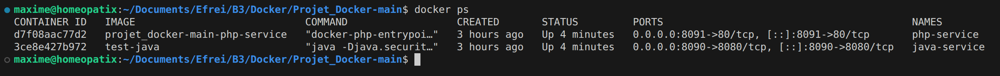
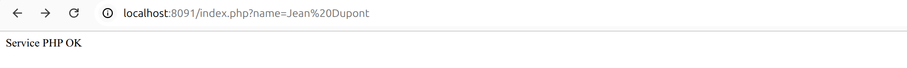
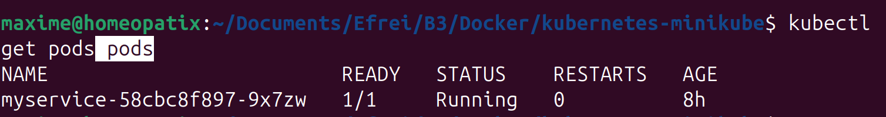
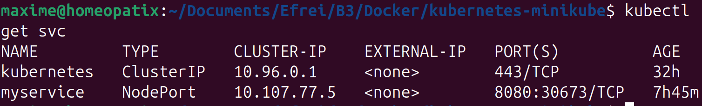
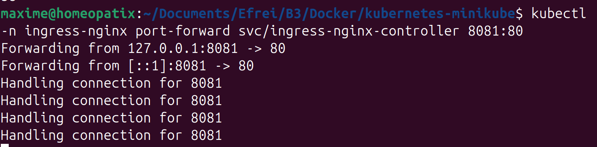
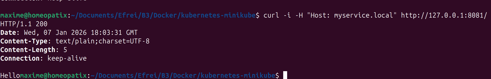
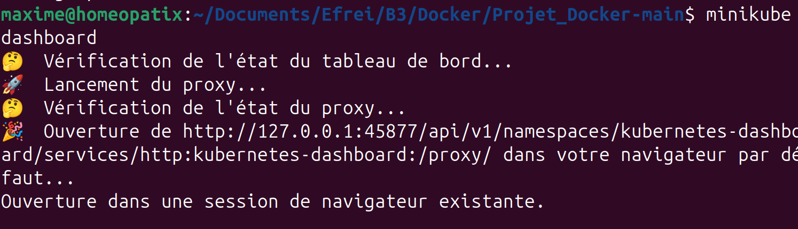
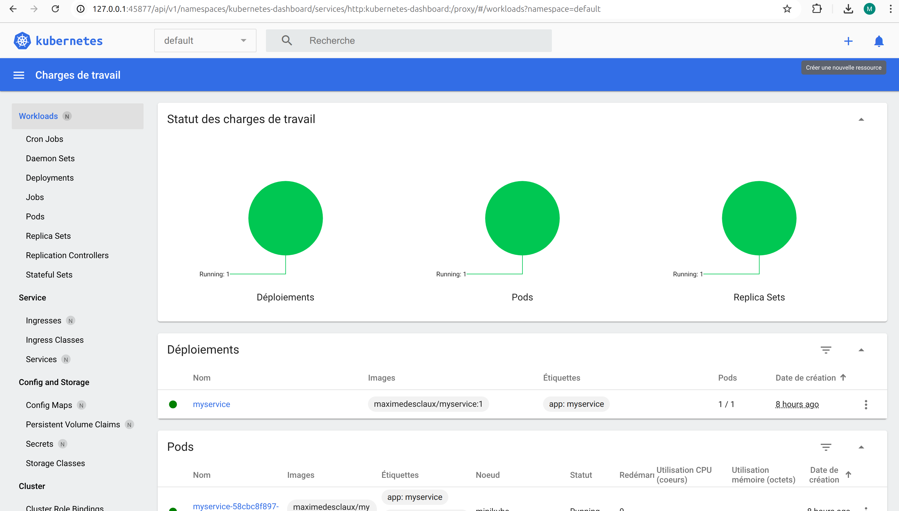

# Projet Docker – Java + PHP Service

## 1. Description du projet

Ce projet comprend deux services communiquant entre eux via Docker :

1. **Java Service (Spring Boot)**
   * Fournit un endpoint `/customer/{name}` qui récupère les données du service PHP.
   * Fichier principal : `RentalService/build/libs/RentalService-0.0.1-SNAPSHOT.jar`.

2. **PHP Service**
   * Fournit un endpoint `/customer/{name}` via un script `index.php`.
   * Répond en affichant : `Bonjour {name} (depuis le service PHP)`.

Le but est de mettre en place les deux services dans des conteneurs Docker et de vérifier la communication entre eux.

---

## 2. Arborescence du projet
```
Projet_Docker-main/
│
├─ RentalService/          # Projet Java Spring Boot
│   ├─ build/libs/
│   │   └─ RentalService-0.0.1-SNAPSHOT.jar
│   ├─ Dockerfile
│   └─ src/
│       └─ main/java/...
│
├─ PHPService/             # Projet PHP
│   ├─ Dockerfile
│   └─ index.php
│
├─ docker-compose.yml
└─ README.md
```

---

## 3. Commandes Docker utilisées

### 3.1 Construction des images

**Java :**
```bash
docker build -t test-java ./RentalService
```

**PHP :**
```bash
docker build -t projet_docker-main-php-service ./PHPService
```

### 3.2 Lancer les conteneurs
```bash
docker compose up --build
```

Vérifier que les deux conteneurs sont en cours d'exécution :
```bash
docker ps
```

Vous devriez voir deux conteneurs : `java-service` (port 8090) et `php-service` (port 8091).




### 3.3 Arrêter les conteneurs
```bash
docker compose down
```

---

## 4. Vérification du fonctionnement

### 4.1 PHP Service

**URL de test :**
```
http://localhost:8091/index.php/customer/Jean%20Dupont
```

**Résultat attendu :**
```
Bonjour Jean Dupont (depuis le service PHP)
```



### 4.2 Java Service

**URL de test :**
```
http://localhost:8090/customer/Jean%20Dupont
```

**Résultat attendu :**
```
Bonjour Jean Dupont (depuis le service PHP)
```


Le service Java appelle automatiquement le service PHP via l'URL définie dans `customer.service.url`.

---

## 5. Configuration à vérifier

### 5.1 docker-compose.yml

La variable d'environnement `customer.service.url` doit pointer vers le service PHP :
```yaml
environment:
  - customer.service.url=http://php-service:80
```

### 5.2 Dockerfile Java

Vérifier que le JAR est bien ajouté :
```dockerfile
FROM eclipse-temurin:21

EXPOSE 8080

ADD build/libs/RentalService-0.0.1-SNAPSHOT.jar app.jar

ENTRYPOINT ["java","-Djava.security.egd=file:/dev/./urandom","-jar","/app.jar"]
```

### 5.3 Dockerfile PHP

Exemple de configuration :
```dockerfile
FROM php:8.1-apache

COPY index.php /var/www/html/

EXPOSE 80
```

---


## 6. Problèmes connus et solutions

| Problème | Solution |
|----------|----------|
| **Erreur `Could not resolve placeholder 'customer.service.url'`** | Vérifier que la variable d'environnement est bien définie dans `docker-compose.yml` ou dans `application.properties` |
| **Port inaccessible** | S'assurer que le port du conteneur est bien exposé et qu'il n'entre pas en conflit avec un autre service |
| **Erreur de build Docker pour Java** | Vérifier que le JAR existe bien dans `build/libs/` avant de lancer le `docker build` |
| **Service PHP non accessible depuis Java** | Vérifier que les deux services sont sur le même réseau Docker et que le nom du service (`php-service`) est correct |

---

## 7. Démarrage rapide

Pour lancer le projet rapidement :
```bash
# Cloner le projet
git clone <url-du-repo>
cd Projet_Docker-main

# Construire et lancer les conteneurs
docker compose up --build

# Tester les services
# PHP : http://localhost:8091/index.php/customer/Jean%20Dupont
# Java : http://localhost:8090/customer/Jean%20Dupont
```

---

## 8. Technologies utilisées

- **Java** : Spring Boot avec OpenJDK 21
- **PHP** : PHP 8.1 avec Apache
- **Docker** : Conteneurisation des services
- **Docker Compose** : Orchestration des conteneurs

---

# 9. Kubernetes – déploiement des microservices

**Screenshots à faire :**
- `kubectl get pods` → tous les pods Running



- `kubectl get svc` → services exposés (php-service, java-service)




## 9.1 Appliquer Kubernetes

```bash
kubectl apply -f kubernetes.yml
```

---

# 10. Gateway – Ingress Nginx

## 10.1 Fichier `ingress.yml`

```yaml
apiVersion: networking.k8s.io/v1
kind: Ingress
metadata:
  name: myservice-ingress
  annotations:
    kubernetes.io/ingress.class: "nginx"
spec:
  rules:
  - host: myservice.local     
    http:
      paths:
      - path: /
        pathType: Prefix
        backend:
          service:
            name: myservice     
            port:
              number: 8080

```

## 11.2 Configurer `/etc/hosts`

Ajouter l'IP de Minikube pour le host `myservice.local` :

```
192.168.58.2 myservice.local
```

## 11.3 Appliquer l'Ingress

```bash
kubectl apply -f ingress.yml
kubectl get ingress
```


## 11.4 Tester la gateway

### Avec curl (il faut ouvrir deux terminaux):

```bash
kubectl -n ingress-nginx port-forward svc/ingress-nginx-controller 8081:80
curl -i -H "Host: myservice.local" http://127.0.0.1:8081/
```





Dashboard de minikube
---





